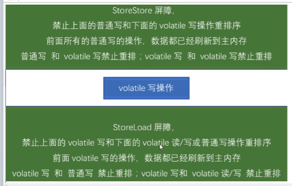
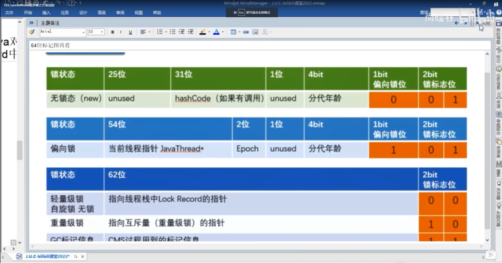

# jhj_cloud
synchronized 原理？
# 乐观和悲观：
乐观（CAS） 加版本号
悲观（synchronized）
# 8锁例子
作用于实例方法，对象锁
作用于代码块，对象锁
静态方法锁的是class类，类锁，非静态锁的是对象
synchronized（this）锁对象？
# synchronized 原理
反编译可以看到，用的是 monitorenter 和 monitorexit 指令，一般情况下 1个monitorenter和 2个 monitorexit
monitorenter表示加锁，然后之后有一些属性 _owner:线程id， count：加锁次数 _recursions:代码块重入次数 entryKist:阻塞线程队列 waitSet:等待队列
1）加锁判断 count是否==0，==0表示没有被该锁其他线程占用
2）判断，若count ！=0，判断占用线程是否是自己，若是可重入参数+1，否则的话阻塞队列+1
3）monitorexit 解锁，推出的时候也要看count参数，因为可能重入次数不是0
acc_static ,acc_synchronized 区分是否静态同步方法
# 为什么任何一个对象都可以成为一个锁？
每一个对象都有监视器object monitor
# 公平和非公平
公平锁：雨露均沾
非公平锁：谁抢到就谁的，别人不能获得锁了
new Reentranlock(false); 
为什么默认非公平？ 1非公平锁能充分利用cpu时间，减少空闲状态  2 减：少线程切换
# AQS？
# 可重入锁，又称 递归锁
只同一个线程获取外层锁时候，可以自动获取内层的锁（前提同一把锁），避免死锁。reentranLock 和 synchronized 都是 可重入锁
## 可重入锁又分为两种 隐式 和 显式
隐式：synchronized ，默认就是可重入锁
显式：reentranLock，自己要注意，锁几次，就需要释放几次
# 死锁和排查
1.jps -l 查看进程 jstack + 进程编号 命令
2 图形化工具
# LockSupport与中断机制
interrupt() 中断此线程。设置中断状态（true）。发起一个协商，不会立刻停止线程。如果线程处于sleep,wait,join等状态，会立即退出阻塞状态并抛出异常
interrupted() 测试当前线程是否被中断。返回中断状态，并清除当前中断状态（false）
isInterrupted() 测试此线程是否已经被中断
## 如何中断线程？
1.通过volatile 变量实现
2.通过AtomicBoolean
3.通过Thread自带的api实现方法实现
# locksupport
## 唤醒线程的三种方法
1 使用object的wait方法让线程等待，使用object的notify方法唤醒 （必须要持有锁了才能调用这两个方法，不然报错；notify必须在wait之后）
2 使用juc condition的await方法让线程等待， 使用signal方法唤醒(也必须要先持有锁；先wait后signal)
3 locksupport类可以阻塞当前线程以及唤醒指定被阻塞的线程(不需要持有锁； 先唤醒（或者叫发出许可证）在等待也是可以的；许可证不会累计，只能一个)
# java内存模型JMM ：
定义：是一种抽象的概念，描述的是一组约定或规范，通过这组规范定义了程序中哥哥变量的读写访问方式并决定一个线程对共享变量的写入图和对另一个线程课件，关键技术点围绕多线程的原子性、可见性、有序性展开
原则：围绕多线程的原子性、可见性、有序性展开
作用： 1 实现线程和主内存的抽象关系 2 、屏蔽硬件和操作系统的内存访问差异，实现java程序在各个平台能达到一致的内存访问结果
## 三大特性：
原子性: 多个线程执行时，一个线程操作不会收到其他线程影响
可见性：当一个线程修改了共享变量，其他线程是否能感知，jmm规定变量都存在主内存
有序性：不会受到指令重排影响
## 线程读取变量过程
所有共享变量都存在物理主内存
每个线程有自己独立的工作内存，保存的是copy的副本
线程对共享变量的操作，必须先修改自己工作内存，再写回主内存
线程无法访问另一个线程的变量
## 多线程先行发生原则 happens-before
1次序规则 ：第一个操作x赋值1 ，后一个操作能感知到x==1
2锁定规则 :同一把锁，先lock 后unlock
3 volatile变量规则：对一个volatile变量，前面的写对后面的读可见
4 传递规则 ： 如果A先于B， B先于C，则A先于C
5 线程启动规则： Thread 的 start方法第一个执行
6 线程中断规则： interrupt方法调用先行与被中断线程的代码里的检测方法；
7 线程终止规则： 线程所有操作先发生于线程的终止检测，我们可以通过isalive判断线程是否被终止了
8 对象终结规则： 对象先 new 后垃圾回收 finalize()
# volatile
特点： 可见、有序
原理：依靠内存屏障
当写操作一个volatile变量时候，会立刻将这个变量刷到主内存
当读取一个volatile变量时候，不读缓存，读主内存
## 内存屏障
是一种屏障指令，她使得cpu或者编译器对屏障指令的前和后的内存指令 执行一个排序的约束

4大指令 
写前 加一个storestore屏障
写后 storeLoad
读前 loadLoad
读后 loadstore
### 内存屏障意义
内存屏障之前所有写操作都要写到主内存
内存屏障之后所有读操作都能获得内存屏障之前所有写操作的最新结果
### 分类
读屏障 ：只要读就读主内存最新的
写屏障 ： 强制写入主内存

#CAS 
compare and swap 比较和交换
缺点： 1.循环消耗CPU 2. ABA问题 （用 AtomicStampedReference 解决，加版本号）
## UnSafe
java无法直接访问底层系统，需要通过native方法，Unsafe相当于一个后门，像C语言一样直接操作内存

## LongAdder 比 AtomicLong 性能封号（减少乐观锁重试次数）
AtomicLong：用的cas自旋锁，如果线程太多，就会有很多线程自旋，性能下降
LongAdder ：CAS+BASE+ cell数组，空间换时间 分散热点，求和：result = base + cell数组之和

# ThreadLocal
线程的局部变量与正常变量不同，因为每个线程访问ThreadLocal的时候都有自己独立的变量副本
ThreadLocal实例通常是类中私有静态字段，使用他的慕斯是希望将状态与线程关联起来
强制：必须回收自定义的ThreadLocal变量,尤其在线程池场景下，线程经常被复用，如不清理，容易导致内存泄漏
## Thread ThreadLocal ThreadLocalMap 区别
Thread里包含 ThreadLocalMap，  ThreadLocalMap 是 ThreadLocal 静态内部类
ThreadLocalMap entry对象，kv键值对，就是一个保存ThreadLocal对象的map，key就是ThreadLocal
ThreadLocal 就是一个空壳子，实际使用的是里面的ThreadLocalMap 内部类
## ThreadLocalMap为什么用弱引用
ThreadLocal<Integer> threadLocal = ThreadLocal.withInitial(()->0);//强引用
当这个方法执行完， threadLocal指向的对象应该被回收，若 ThreadLocalMap 是强引用，key指向ThreadLocal对象，他就不会被回收，造成内存泄漏
## ThreadLocalMap 用弱引用就万事大吉了吗
虽然弱引用保证了ThreadLocal能被回收，但是v指向的对象是需要ThreadLocalMap调用get或者set的时候发现key为null才回去回收，所以不能100%保证内存不泄漏
所以，我们要手动调用remove方法
？？？
从set，get，remove方法看出。针对内存泄漏问题，都会通过expungeStaleEntry,cleanSomeSlots,replaceStaleEntry总金额三个方法清理掉key为null的脏entry
## ThreadLocal总结
1.不解决线程间共享变量问题
2.适用于线程间隔离且在方法共享的场景
3.通过隐式在不同线程创建独立副本避免线程安全问题
3.每个线程持有一个专属map，该map只被只有他的线程访问
4.ThreadLocalMap的entry对ThreadLocal是弱引用，避免无法被回收
5.expungeStaleEntry,cleanSomeSlots,replaceStaleEntry ，目的清除脏entry
# 对象内存布局
## new 了一个Object对象有哪些东西
对象头（包括对象标记和类型指针（也叫类元信息））、实例数据、对齐填充（保证8字节的倍数）
对象头的对象标记里有： 哈希码，对象分代年龄，gc标记，gc次数，锁标记，偏向锁持有者
实例数据：属性内容

# JOL
## 分代年龄最大15，因为存储分代次数是4位数 1111=15

# synchronized 与 锁升级

偏向锁：MarkWord 存储的是偏向的线程id；
轻量锁：MarkWord 存储的是指向栈中lock record的指针；
重量锁：MarkWord 存储的是指向堆中的monitor对象的指针；
