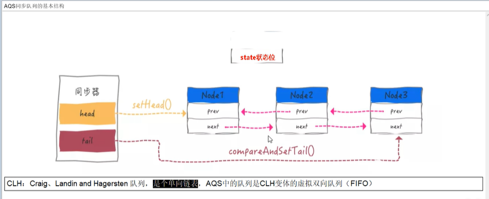
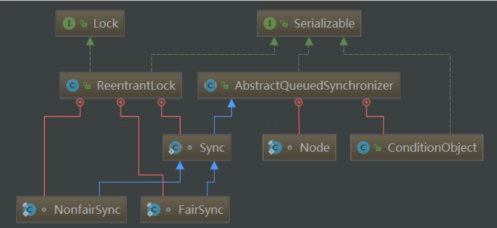

# AQS
抽象的队列同步器。 是JUC体系的基石
为实现阻塞锁和相关同步器提供一个框架，他是依赖于先进先出的一个等待
依靠单个原子int值来表示状态，通过占用和释放方法，改变状态值
整体就是一个抽象的FIFO队列来完成资源获取线程的排队工作，并通过一个int变量表示持有锁的状态
CLH队列：1 自旋等待 2 state变量判断是否阻塞 3、尾部入队 头部出队
公平锁和非公平锁唯一区别就是 lock方法，公平锁多了一个 hasQueuedPredecessors()方法，判断等待队列是否存在有效节点
tryAcquire 尝试获取锁
addwaiter 进入等待队列
enq入队
reentrantlock加锁过程 分三个阶段： 
1、尝试加锁 2、加锁失败，进入队列 3、线程入队列后，进入阻塞

# 无锁-独占锁-读写锁-邮戳锁
## reentrantReadWriteLock 是什么
定义：一个资源可以被多个读线程访问，或被一个写线程访问。但是不能同时存在读写线程
缺点：
1锁饥饿问题（读太多导致不能写）/
2注意：锁降级： 遵循获取写锁、获取读锁、释放写锁的次序， 降级为读锁
如果同一个线程持有了写锁，在没有释放写锁的情况下，还可以获取读锁
## StampedLock 邮戳锁
StampedLock对reentrantReadWriteLock进行优化，在StampedLock采用乐观锁，在获取读锁时，其他线程可以获取锁，但需要对结果校验
1 获取锁方法，返回邮戳（stamp），0失败
2 释放锁方法，都需要一个邮戳
3 StampedLock 不可重入（锁不能获取两次）
4 三种访问模式 ： 1 reading（读悲观模式），功能和 reentrantReadWriteLock类似
                2 write（写模式）reentrantReadWriteLock
                 3 optimistic reading（乐观读） 无锁机制，类似于数据库的乐观岁锁，支持读写并发
缺点： 1.不支持重入
      2.不支持Condition
      3. 不要调用中断 interrupt 方法